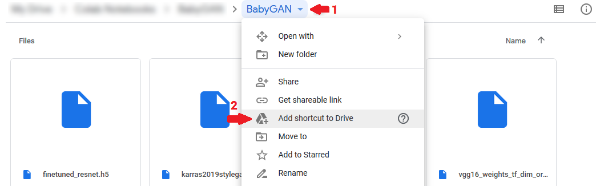

# BabyGAN

**Check how it works online:**
- Russian Language 
- English Language 

StyleGAN-based predictor of children's faces from photographs of theoretical parents. The latent representation is extracted from the input images, after which the algorithm mixes them in certain proportions. The neural network model is based on the GAN architecture. Using latency direction, you can change various parameters: age, face position, emotions and gender.

  

**Based on:** [StyleGAN](https://github.com/NVlabs/stylegan)

**Encoder:** [StyleGAN-Encoder](https://github.com/pbaylies/stylegan-encoder)

## Pre-train Models and dictionaries
Follow the [LINK](https://drive.google.com/drive/folders/1xwqqG0HkLe2AiXxjC-XK8OfvMKT1jBlp) and add shortcut to Drive:

The folder structure should be:
    
    .
    ├── data                    
    │   └── finetuned_resnet.h5 
    ├── karras2019stylegan-ffhq-1024x1024.pkl
    ├── shape_predictor_68_face_landmarks.dat.bz2
    ├── vgg16_weights_tf_dim_ordering_tf_kernels_notop.h5
    ├── vgg16_zhang_perceptual.pkl
    └── ...

## Prerequisites
* 64-bit Python 3.6 installation.
* TensorFlow 1.10.0 with GPU support.
* One or more high-end NVIDIA GPUs with at least 11GB of DRAM.
* NVIDIA driver 391.35 or newer, CUDA toolkit 9.0 or newer, cuDNN 7.3.1 or newer.

## Generating latent representation of your images
You can generate latent representations of your own images using two scripts:
1) Create folders for photos
> mkdir raw_images aligned_images

2) Extract and align faces from images
> python align_images.py raw_images/ aligned_images/

3) Find latent representation of aligned images
> python encode_images.py aligned_images/ generated_images/ latent_representations/

## Usage BabyGAN
- SOON
